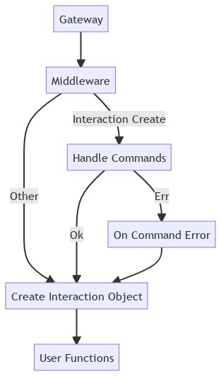
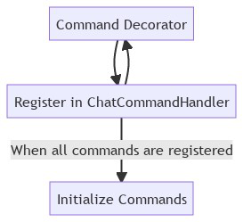

# Gateway

### Gateway
The gateway is where events from Discord are recieved. Sharding is not currently implemented in the lib but when it is, it will be mentioned in this section.
[Link](https://discord.com/developers/docs/topics/gateway).
### Middleware
Middleware is where gateway events are handled by the user. Most middleware in the lib just create an object to pass to the user functions.
### Handling Commands
The `interaction_create` middleware handles application commands and autocomplete.
### On Command Error
The `on_command_error` function will be run if the one of the commands raises an exception. This needs a lot of work so it shouldn't be used right now.
### Create Interaction Objects
Every single middleware has to create objects. These can all be found in the object folder. They are either a "generic" object like `User` or an object specialized for this event like `GuildMembersChunkEvent`.
### User Functions
User function are the corosponding function with the `@Client.event` decorator.

# Command Registration
